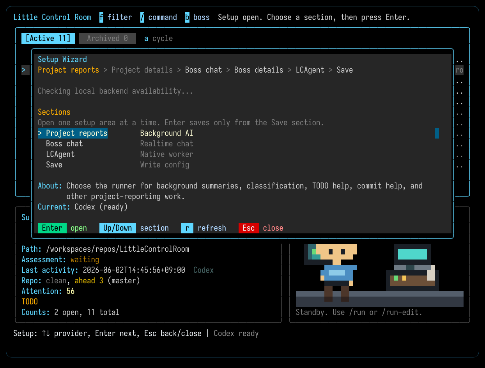
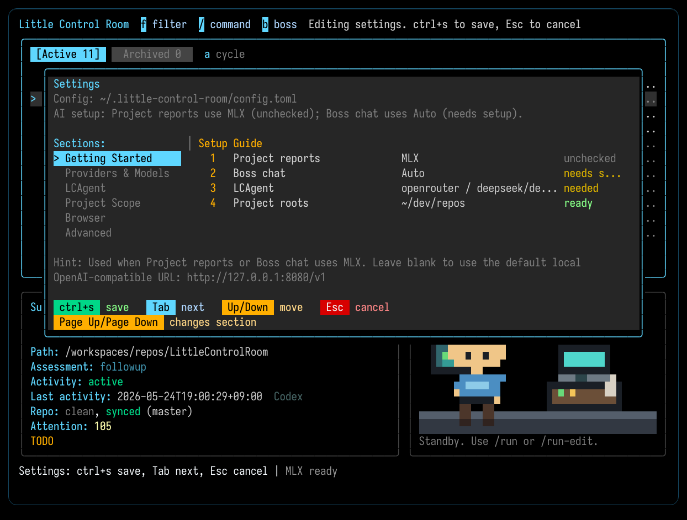
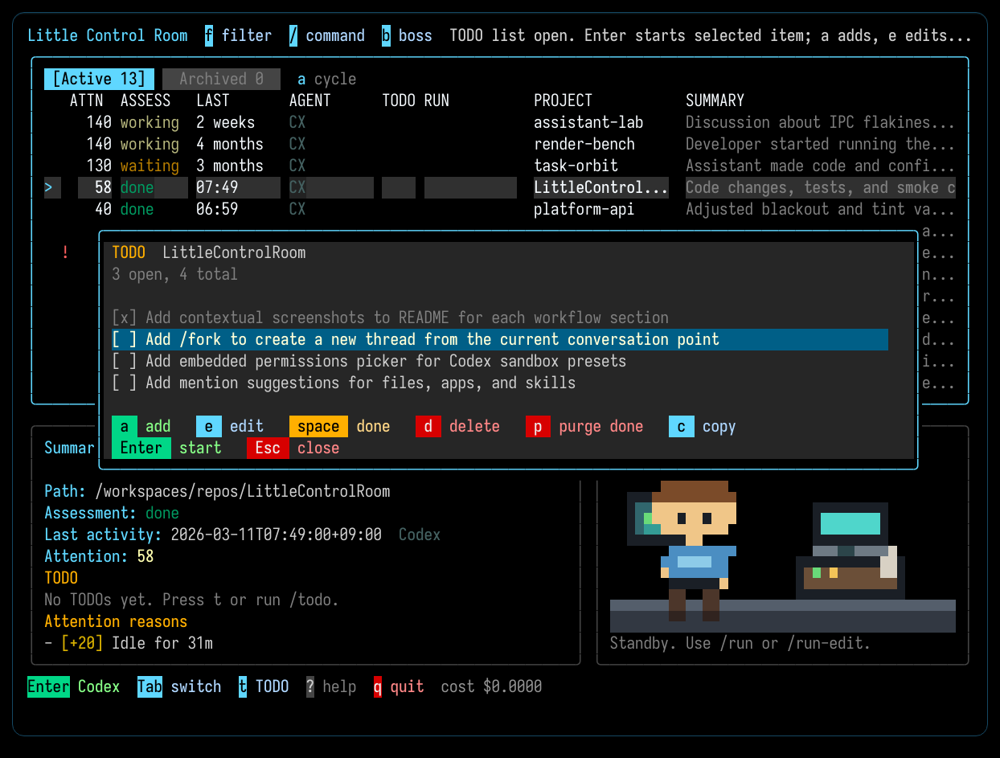

# Little Control Room

Little Control Room (LCR) is a terminal control room I built for my own agent-heavy workflow across many repos.

I use it to keep Codex, OpenCode, and Claude Code sessions visible, jump back into work quickly, start fresh sessions from TODOs, review diffs, and ship changes without bouncing between tools. For background AI work, it can also route through local MLX or Ollama servers.

It is also used internally, but this is not a commercial product. It is an opinionated open source tool that grew out of day-to-day use.

<p align="center">
  <a href="docs/screenshots/main-panel.png">
    
  </a>
</p>

## Why I Built It

- Too many repos and too many live agent sessions are hard to coordinate from separate terminals and tabs.
- I wanted one terminal-first place to see what is active, what is worth revisiting, and what I can ship next.
- I wanted TODOs, diffs, commit help, and embedded sessions to stay close to each other instead of being spread across several tools.

## What It Helps With

- Finding recent Codex, OpenCode, and Claude Code sessions across local projects
- Seeing which projects are active, idle, or worth revisiting
- Opening, resuming, or switching embedded Codex, OpenCode, or Claude Code sessions directly from the dashboard
- Reopening Claude Code sessions that are already running in another terminal
- Keeping common actions close at hand: refresh, pin, snooze, per-project TODO lists, managed per-project run commands with runtime/port badges, diff, commit, and push

## What It Does Not Do Yet

- Many Codex slash-commands are missing.
- Embedded Claude Code support is now available through Claude's headless CLI flow, but it is still an MVP: it now has a usable model picker with saved preferences, while approval parity, compact, and attachments are not fully wired yet.

## Quick Start

Requirements:

- Go 1.25+ (only if building from source)
- Codex installed locally, capable of running in the terminal.
- OpenCode installed locally if you want embedded OpenCode sessions.
- Claude Code installed locally if you want embedded Claude Code sessions.
- At least one AI backend configured: Codex, OpenCode, Claude Code, MLX, Ollama, or direct OpenAI API.

### Prebuilt binaries

Prebuilt binaries are the intended install path. Download the archive for your platform from the [Releases page](https://github.com/dpasca/LittleControlRoom/releases), or use the source build below if no release asset is available yet.

```bash
# Example: macOS ARM64
curl -L -o lcroom.tar.gz https://github.com/dpasca/LittleControlRoom/releases/latest/download/lcroom_Darwin_arm64.tar.gz
tar -xzf lcroom.tar.gz
./lcroom tui
```

Release archives include `lcroom` and the sibling `lcagent` helper binary used by the experimental embedded LCAgent provider.

### Build from source

```bash
make build
./lcroom tui
```

To build both local binaries:

```bash
make build-all
./lcroom tui
```

Or install the CLI to your Go bin:

```bash
make install
lcroom tui
```

On the first run, LCR opens `/setup` if no AI backend is configured. `/setup` is the Getting Started view inside `/settings`: choose the backend for project reports, choose whether boss chat should use a separate realtime backend, then press Enter on a row to drill into only the fields that path needs. Shared connection fields, such as OpenAI API, MLX, or Ollama, appear inside those focused setup panels when selected. `/settings` keeps Providers & Models minimal as a connection/status inventory plus global model-display defaults. Claude-backed background inference currently defaults to Haiku to keep usage lighter. MLX and Ollama use their OpenAI-compatible local endpoints, with defaults of `http://127.0.0.1:8080/v1` for MLX and `http://127.0.0.1:11434/v1` for Ollama.

<p align="center">
  <a href="docs/screenshots/setup.png">
    
  </a>
</p>

## Background AI Backends

LCR separates embedded session providers from the backend used for background work such as summaries, classification, commit help, and TODO worktree suggestions.

- Embedded sessions today are Codex, OpenCode, and Claude Code.
- Background AI can run through Codex, OpenCode, Claude Code, MLX, Ollama, or direct OpenAI API.
- Boss chat has its own `boss_chat_backend`, so interactive high-level chat can use direct API inference through OpenAI API, MLX, or Ollama without forcing summaries/classification off Codex, OpenCode, Claude Code, MLX, or Ollama. If it is not configured yet, `/boss` offers to jump straight to the Boss chat setup card.
- MLX and Ollama use OpenAI-compatible local endpoints, so they fit into the same background inference path without a separate integration surface.

For local inference, the practical setup is:

- Pick `MLX` or `Ollama` in `/setup`.
- Leave the endpoint fields blank in `/settings` if you want the defaults.
- Or edit the MLX/Ollama endpoint fields in `/settings` if your local server runs elsewhere.

Default local endpoints:

- MLX: `http://127.0.0.1:8080/v1`
- Ollama: `http://127.0.0.1:11434/v1`

<p align="center">
  <a href="docs/screenshots/settings-local-backends.png">
    
  </a>
</p>

## Slash Commands

The main TUI command palette opens with `/`.

- `/help`: Open the help panel.
- `/refresh`: Rescan projects and retry failed assessments.
- `/sort <attention|recent>`: Change the project ordering.
- `/view <ai|all>`: Switch between AI-linked and all tracked folders.
- `/tab [active|archived|toggle]`: Switch the project list between Active and Archived tabs.
- `/setup`: Open the Getting Started settings for first-run AI roles. Runs automatically on launch until you pick a backend.
- `/settings`: Full preferences with Getting Started first, then Providers & Models, LCAgent, Project Scope, Browser, and Advanced.
- `/filter [text|clear]`: Temporarily narrow the whole dashboard to matching project names.
- `/new-project [--assistant codex|opencode|claude|lcagent]`: Create a project folder, or use path suggestions/paste an existing project path to add it directly. The dialog also lets you choose which assistant `Enter` should open first for the new item, defaulting to the last embedded provider you used when available.
- `/new-task [--assistant codex|opencode|claude|lcagent] [request]`: Create a scratch task folder under the default task root. Optional request text seeds the temporary task name, and the assistant flag preselects the first embedded provider for `Enter`; without a flag, the task picker defaults to the last embedded provider you used when available.
- `/task-actions`: Open archive/delete actions for the selected scratch task.
- `/open`: Open the selected project's folder in the system browser.
- `/run [command]`: Start the selected project's managed runtime.
- `/start [command]`: Alias for `/run`.
- `/restart`: Restart the selected project's managed runtime.
- `/run-edit`: Edit the saved runtime command.
- `/runtime`: Focus the runtime pane.
- `/stop`: Stop the selected project's managed runtime.
- `/todo`: Open the TODO list for the selected project. Add items, toggle done, and start a fresh embedded session from any item.
- `/diff`: Open the full-screen git diff.
- `/commit [message]`: Preview a commit for the selected project.
- `/push`: Push the selected project's branch.
- `/resolve`: Start a fresh engineer session to resolve selected repo merge conflicts.
- `/codex [prompt]`: Resume the latest Codex session or start one.
- `/codex-new [prompt]`: Start a fresh Codex session.
- `/claude [prompt]`: Resume the latest Claude Code session or start one.
- `/claude-new [prompt]`: Start a fresh Claude Code session.
- `/opencode [prompt]`: Resume the latest OpenCode session or start one.
- `/opencode-new [prompt]`: Start a fresh OpenCode session.
- `/lcagent [prompt]`: Resume the latest experimental LCAgent session or start one.
- `/lcagent-new [prompt]`: Start a fresh experimental LCAgent session.
- `/pin`: Toggle pin on the selected project.
- `/read [all]`: Mark the selected project, or all visible projects, as read.
- `/unread`: Mark the selected project's latest completed assessment as unread.
- `/snooze [duration|off]`: Snooze the selected project, or clear snooze with `off`.
- `/unsnooze` (alias: `/clear-snooze`): Clear the selected project's snooze.
- `/sessions <on|off|toggle>`: Show or hide the Sessions section.
- `/events <on|off|toggle>`: Show or hide Recent events.
- `/focus <list|detail|runtime>`: Move focus between panes.
- `/ignore`: Hide the selected project's exact name.
- `/ignored`: Review ignored names and paths, then restore them.
- `/archive`: Move the selected project to the Archived tab.
- `/unarchive`: Move the selected archived project back to Active when it is in scope.
- `/remove`: Confirm, then make the selected item go away safely. For regular projects, hides only the selected path. Aliases: `/delete`, `/forget`.
- `/quit`: Quit the TUI.

Inside the embedded Codex, Claude Code, or OpenCode pane:

- `/new`: Start a fresh session for the current provider.
- `/sessions [session-id]`: Open this project's session-history picker or jump to a saved session.
- `/resume [session-id]` and `/session [session-id]`: Aliases for `/sessions`.
- `/reconnect`: Restart the embedded provider helper and reconnect to the current session.
- `/model`: Change the model and reasoning settings for this and future embedded sessions of the same tool, including after restarting LCR.
- `/status`: Show the current provider/session status.
- `/compact`: Compact the embedded Codex conversation history when supported.
- `/review`: Ask embedded Codex to review uncommitted changes.

Inside boss chat:

- `Alt+1` through `Alt+8`: Open the matching marked Boss Desk task or project in an embedded engineer session.
- `Alt+Up`: Hide Boss Chat and return to the classic TUI; in-flight replies keep running.
- `/new [prompt]`: Start a fresh boss chat session, optionally with the first prompt.
- `/sessions [session-id]`: Open the saved-session picker, or switch directly by ID.
- `/session [session-id]` and `/resume [session-id]`: Aliases for `/sessions`.
- `/help`: Show boss chat slash commands.
- `/boss off`: Hide Boss Chat and return to the classic TUI; in-flight replies keep running.

Boss chat sessions are saved as grep-friendly Markdown transcripts under the app data directory, for example `~/.little-control-room/boss-sessions/`. The `/sessions` picker uses those files for human session switching, and Boss Chat recall searches the same transcripts. Codex, OpenCode, and Claude Code transcripts are called engineer sessions in Boss Chat so they stay distinct from Boss Chat's own transcript.

## Core Workflows

1. Start the dashboard with `lcroom tui` or `./lcroom tui`.
2. Move through projects with the arrow keys.
3. Press `Enter` to open or resume the selected project's latest embedded provider. Fresh projects and scratch tasks use the assistant chosen in their create dialog, which defaults to the last embedded provider you used when available.
4. Press `Esc` to hide the embedded session pane while it keeps working, then press `Enter` on that project to reopen it from the list.
5. Press `/` for commands, `f` to filter the project list instantly, `a` to switch Active/Archived project tabs, or `b` for Boss Chat.

Most day-to-day use falls into a few buckets:

- **Run and monitor** — Use `/run` or `/start` to launch a saved runtime, `/restart` to bounce it, `/run-edit` to change the command, and `/stop` to shut it down. Press `Tab` or `/runtime` when you want to work directly in the runtime pane.

  [](docs/screenshots/main-panel-live-runtime.png)

- **Resume agent work** — Use `/codex`, `/claude`, `/opencode`, or experimental `/lcagent` to pick up where you left off, and `/codex-new`, `/claude-new`, `/opencode-new`, or `/lcagent-new` when you want a fresh session. Inside the embedded pane, `/sessions`, `/resume`, `/session`, and `/reconnect` handle project-local session history or reattaching the helper. LCAgent also supports `/permissions` to explain Off/Low/Medium and `/permissions medium` or `/permissions low` to change the current session's next-turn autonomy. Claude Code support currently uses a headless CLI MVP, so approvals and attachments are still less complete than Codex/OpenCode, even though `/model` now offers saved Claude aliases and reasoning levels. LCAgent is a one-shot LCR-native worker with provider-backed tool calls and structured local JSONL artifacts.

  [](docs/screenshots/codex-embedded.png)

- **Tune LCAgent permissions** — In `/settings`, Low lets LCAgent edit workspace files and run read-only or recognized verification commands, then asks before broader commands. Medium lets it run workspace-contained commands without repeated approvals. When a Low run asks for command approval, press `a` to approve once or `A` to switch that LCAgent run to Medium.

- **TODO-driven sessions** — Press `t` or use `/todo` to open a per-project TODO list. Add items you want an agent to work on, then press `Enter` on any item to start a fresh embedded session with that task as the prompt. The dialog shows the model that will be used and lets you pick the provider (Codex, Claude Code, OpenCode, or experimental LCAgent).

  [](docs/screenshots/todo-dialog.png)

- **Review and organize** — Use `/diff` to inspect git changes, `/commit` and `/push` when you are ready to ship, and `/open` to jump to the project folder.

  | Diff View | Commit Preview | Image Diff |
  | --- | --- | --- |
  | [](docs/screenshots/diff-view.png) | [](docs/screenshots/commit-preview.png) | [](docs/screenshots/diff-view-image.png) |

- **Keep the list clean** — Use `a` or `/tab` to switch between Active and Archived project tabs, `/archive` and `/unarchive` to move regular projects between them, `f` or `/filter <text>` to narrow the project list, and `/pin` or `/snooze` to control attention. Use `/remove` when an item should go away by its safest matching action, `/ignore` for an exact-name hide rule, and `/ignored` to restore hidden names or paths.
- **Adjust setup** — `/setup` jumps to the Getting Started settings; `/settings` is the full preferences panel. Getting Started covers project-report AI, boss chat, LCAgent, and project search paths through focused setup panels. Shared provider connection fields are reused inside those panels, so the same OpenAI/MLX/Ollama settings and LCAgent provider keys are edited from whichever feature needs them. Providers & Models stays compact: connection status plus global launch/display defaults. Project Scope controls include/exclude paths and privacy patterns. Browser sets the Playwright window policy. Advanced holds refresh thresholds and low-level tuning knobs. For embedded Codex and OpenCode sessions, LCR can isolate Playwright per session so browser-heavy work multitasks more cleanly in parallel, then surface the right managed browser window only when a human step is actually needed. Switch to `Classic browser behavior` if you want the original provider-owned flow, then use `/new-project` for repo-backed work and `/new-task` for quick scratch work.

For the full command list and detailed behavior, see [`docs/reference.md`](docs/reference.md).

## Costs

If Codex, OpenCode, Claude Code, MLX, or Ollama is available, LCR can use that local provider path for summaries, classification, commit help, and other background inference. On a flat-rate plan, or when you are running local inference, that usually means no extra LCR API cost from LCR itself. Claude-backed background inference currently defaults to Haiku to keep usage lighter.

If you use an OpenAI API key for background analysis, LCR mainly spends tokens on summaries/classification and commit help. Boss chat can also use direct API inference through its separate `boss_chat_backend`; keep that in mind when reading cost estimates, since the project-analysis footer is not meant to be the full billing ledger for interactive chat.

With a few active projects, a full day is often around `$1` to `$2`, but treat that as a rough guide. The OpenAI dashboard is the billing source of truth.

Type `/setup` from the TUI or edit `~/.little-control-room/config.toml` to change the provider.

## Notes

- Local state lives under `~/.little-control-room/`.
- For keys, slash commands, flags, and config details, see [`docs/reference.md`](docs/reference.md).

## Contacts

- Davide Pasca on X: [@109mae](https://x.com/109mae)
- NEWTYPE, Japan: [newtypekk.com](https://newtypekk.com/)

## Contributing

This is a utility that I constantly change to suit some specific needs. For this reason this is not a good candidate for external contributions, however, bug reports are welcome and anyone is free to fork and modify for their own use.
