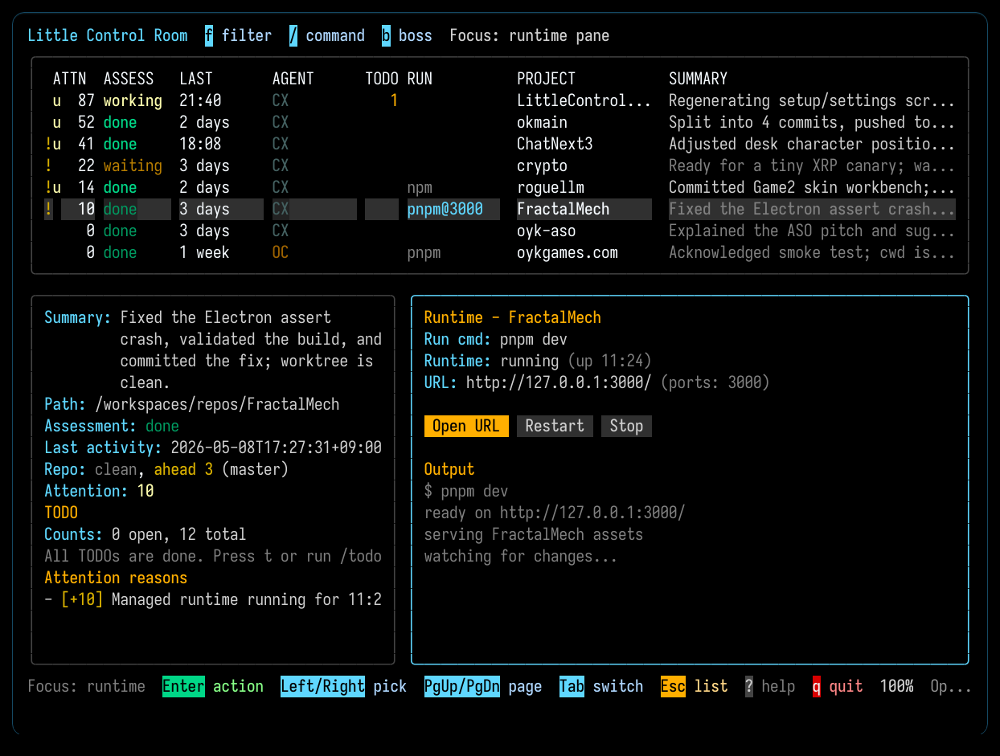

# Little Control Room

Little Control Room (LCR) is a modern day IDE for developers using Codex, OpenCode, and Claude Code.

LCR is meant to be a single window where you can coordinate most of your development activity, multitasking across dozens of projects and sessions as well as possible.

LCR shows you in real time the progress of each Codex, OpenCode, and Claude Code session, and lets you open, resume, or switch sessions, view diffs, generate commits with automatic messages, and manage per-project runtimes, all without leaving the dashboard.

## Screenshots

Click any screenshot to open the full-size PNG on GitHub.

<p align="center">
  <a href="docs/screenshots/main-panel.png">
    
  </a>
</p>

| Dashboard | Runtime Pane |
| --- | --- |
| [](docs/screenshots/main-panel.png) | [](docs/screenshots/main-panel-live-runtime.png) |

| Embedded Session | Diff View |
| --- | --- |
| [](docs/screenshots/codex-embedded.png) | [](docs/screenshots/diff-view.png) |

| Commit Preview | Image Diff |
| --- | --- |
| [](docs/screenshots/commit-preview.png) | [](docs/screenshots/diff-view-image.png) |

## What It Does

- Finds recent Codex, OpenCode, and Claude Code sessions across your local projects
- Shows which projects are active, idle, or worth revisiting
- Lets you open, resume, or switch embedded Codex or OpenCode sessions directly from the dashboard
- Detects Claude Code sessions running in a separate terminal and shows their transcript read-only
- Keeps common actions close at hand: refresh, pin, snooze, multiline project notes with list badges, managed per-project run commands with runtime/port badges, diff, commit, and push

## What it doesn't do (yet)

- Many Codex slash-commands are missing.
- Claude Code integration is read-only (session detection and transcript viewing). Full embedded support depends on Claude Code exposing a server/RPC mode.

## Quick Start

Requirements:

- Go 1.25+
- Codex installed locally, capable of running in the terminal.
- OpenCode installed locally if you want embedded OpenCode sessions.
- Claude Code installed locally if you want read-only Claude Code session awareness.
- At least one AI backend configured: Codex, OpenCode, or an OpenAI API key.

Build and launch from this repo:

```bash
make build
./lcroom tui
```

Or install the CLI to your Go bin:

```bash
make install
lcroom tui
```

On the first run, LCR opens `/setup` if no AI backend is configured. From there you can use Codex, OpenCode, an OpenAI API key, or continue without AI and come back later.

## Slash Commands

The main TUI command palette opens with `/`.

- `/help`: Open the help panel.
- `/refresh`: Rescan projects and retry failed assessments.
- `/sort <attention|recent>`: Change the project ordering.
- `/view <ai|all>`: Switch between AI-linked and all tracked folders.
- `/setup`: Choose and check the AI backend for summaries and commit help.
- `/settings`: Edit scope, filters, and scan settings.
- `/filter [text|clear]`: Temporarily narrow the whole dashboard to matching project names.
- `/new-project`: Create a project folder, or paste an existing project path to add it directly.
- `/open`: Open the selected project's folder in the system browser.
- `/run [command]`: Start the selected project's managed runtime.
- `/start [command]`: Alias for `/run`.
- `/restart`: Restart the selected project's managed runtime.
- `/run-edit`: Edit the saved runtime command.
- `/runtime`: Focus the runtime pane.
- `/stop`: Stop the selected project's managed runtime.
- `/note [clear]`: Edit or clear the selected project's note.
- `/todo`: Open the TODO list for the selected project. Add items, toggle done, and start a fresh embedded session from any item.
- `/diff`: Open the full-screen git diff.
- `/commit [message]`: Preview a commit for the selected project.
- `/push`: Push the selected project's branch.
- `/codex [prompt]`: Resume the latest Codex session or start one.
- `/codex-new [prompt]`: Start a fresh Codex session.
- `/opencode [prompt]`: Resume the latest OpenCode session or start one.
- `/opencode-new [prompt]`: Start a fresh OpenCode session.
- `/pin`: Toggle pin on the selected project.
- `/snooze [duration|off]`: Snooze the selected project, or clear snooze with `off`.
- `/unsnooze` (alias: `/clear-snooze`): Clear the selected project's snooze.
- `/sessions <on|off|toggle>`: Show or hide the Sessions section.
- `/events <on|off|toggle>`: Show or hide Recent events.
- `/focus <list|detail|runtime>`: Move focus between panes.
- `/ignore`: Hide the selected project's exact name.
- `/ignored`: Review ignored names and restore them.
- `/forget`: Forget a selected missing folder.
- `/quit`: Quit the TUI.

Inside the embedded Codex or OpenCode pane:

- `/new`: Start a fresh session for the current provider.
- `/resume [session-id]`: Open the session picker or jump to a saved session.
- `/session [session-id]`: Alias for `/resume`.
- `/reconnect`: Restart the embedded provider helper and reconnect to the current session.
- `/model`: Change the model and reasoning settings for this and future embedded sessions of the same tool, including after restarting LCR.
- `/status`: Show the current provider/session status.

## Everyday Workflow

1. Start the dashboard with `lcroom tui` or `./lcroom tui`.
2. Move through projects with the arrow keys.
3. Press `Enter` to open or resume the selected project's latest embedded provider.
4. Press `Esc` or `Alt+Up` to hide the embedded session pane while it keeps working, then press `Enter` on that project to reopen it from the list.
5. Press `/` for commands, or `f` to filter the project list instantly.

Most day-to-day use falls into a few buckets:

- `🚀 Run and monitor`: Use `/run` or `/start` to launch a saved runtime, `/restart` to bounce it, `/run-edit` to change the command, and `/stop` to shut it down. Press `Tab` or `/runtime` when you want to work directly in the runtime pane.
- `🤖 Resume agent work`: Use `/codex` or `/opencode` to pick up where you left off, and `/codex-new` or `/opencode-new` when you want a fresh session. Inside the embedded pane, `/resume`, `/session`, and `/reconnect` handle switching sessions or reattaching the helper. Projects with Claude Code activity are detected automatically and shown with a `CC` tag; press `Enter` to view the transcript read-only.
- `🧹 Keep the list clean`: Use `f` or `/filter <text>` to narrow the project list, `/pin` and `/snooze` to control attention, `/ignore` and `/ignored` to hide or restore exact project names, and `/forget` to remove a missing folder.
- `📋 TODO-driven sessions`: Press `t` or use `/todo` to open a per-project TODO list. Add items you want an agent to work on, then press `Enter` on any item to start a fresh embedded session with that task as the prompt. The dialog shows the model that will be used and lets you pick the provider (Codex or OpenCode).
- `📝 Review and organize`: Use `/note` or `n` for project notes, `/diff` to inspect git changes, `/commit` and `/push` when you are ready to ship, and `/open` to jump to the project folder.
- `⚙️ Adjust setup`: Use `/settings` for API keys, paths, and defaults, and `/new-project` when you want to add something new to the dashboard.

For the full command list and detailed behavior, see [`docs/reference.md`](docs/reference.md).

## Costs

If Codex or OpenCode is available, LCR can use that local login for summaries and commit help. On a flat-rate plan, that usually means no extra LCR API cost.

If you use an OpenAI API key instead, LCR mainly spends tokens on summaries/classification and commit help. The footer shows a live estimate for that API usage only.

With a few active projects, a full day is often around `$1` to `$2`, but treat that as a rough guide. The OpenAI dashboard is the billing source of truth.

Type `/setup` from the TUI or edit `~/.little-control-room/config.toml` to change the provider.

## Notes

- Local state lives under `~/.little-control-room/`.
- For keys, slash commands, flags, and config details, see [`docs/reference.md`](docs/reference.md).

## Contacts

- Davide Pasca on X: [@109mae](https://x.com/109mae)
- NEWTYPE, Japan: [newtypekk.com](https://newtypekk.com/)

## Contributing

This is a utility that I constantly change to suit some specific needs. For this reason this is not a good candidate for external contributions, however, bug reports are welcome and anyone is free to fork and modify for their own use.
