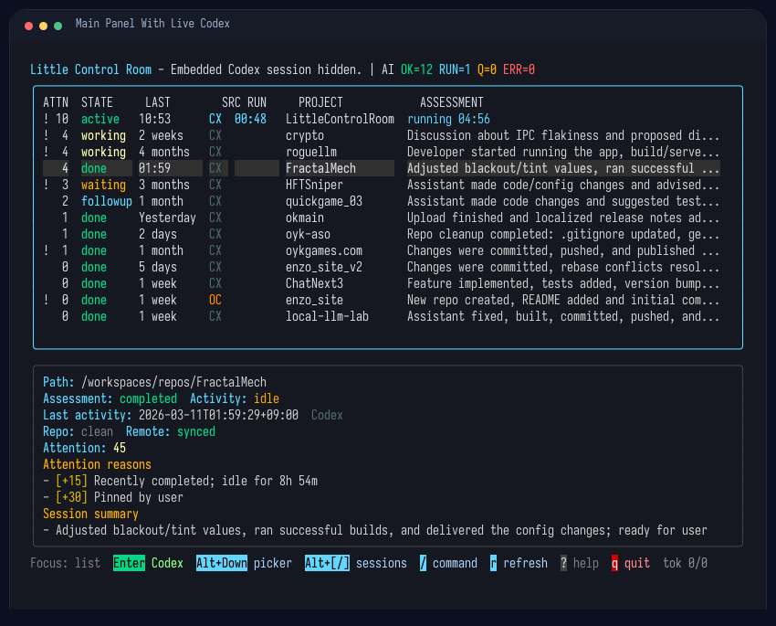
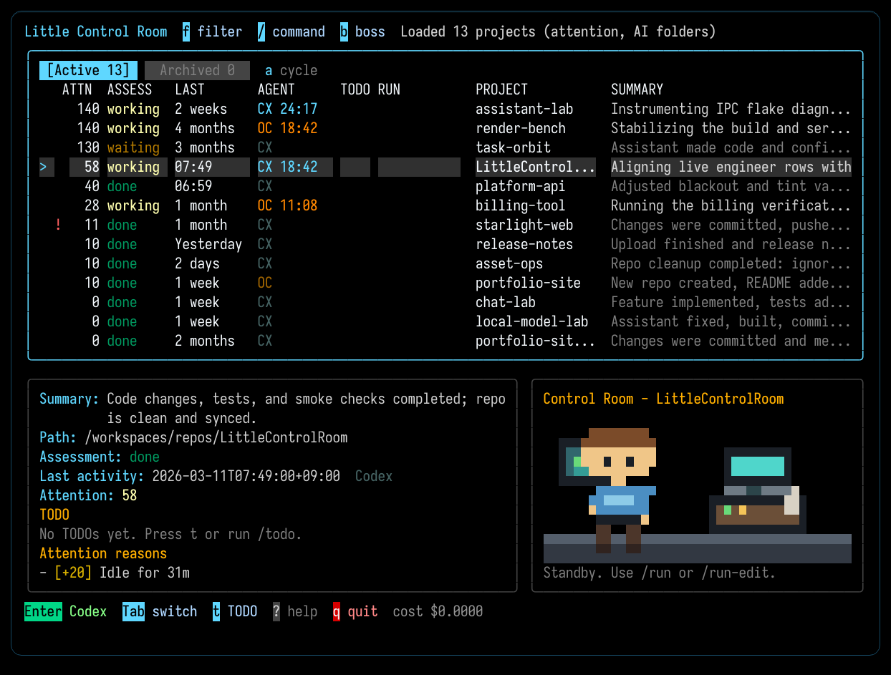
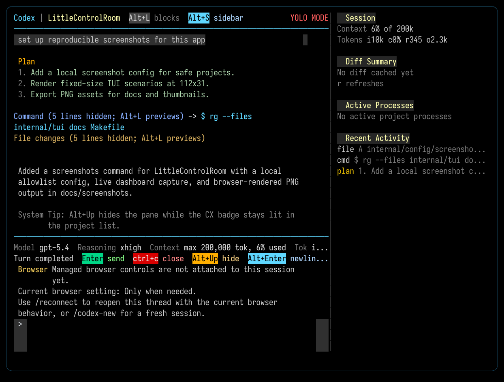
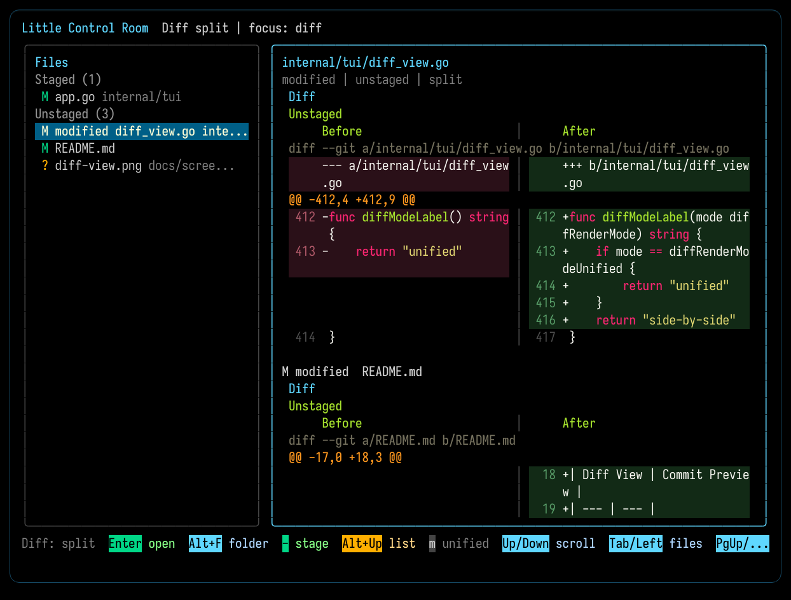
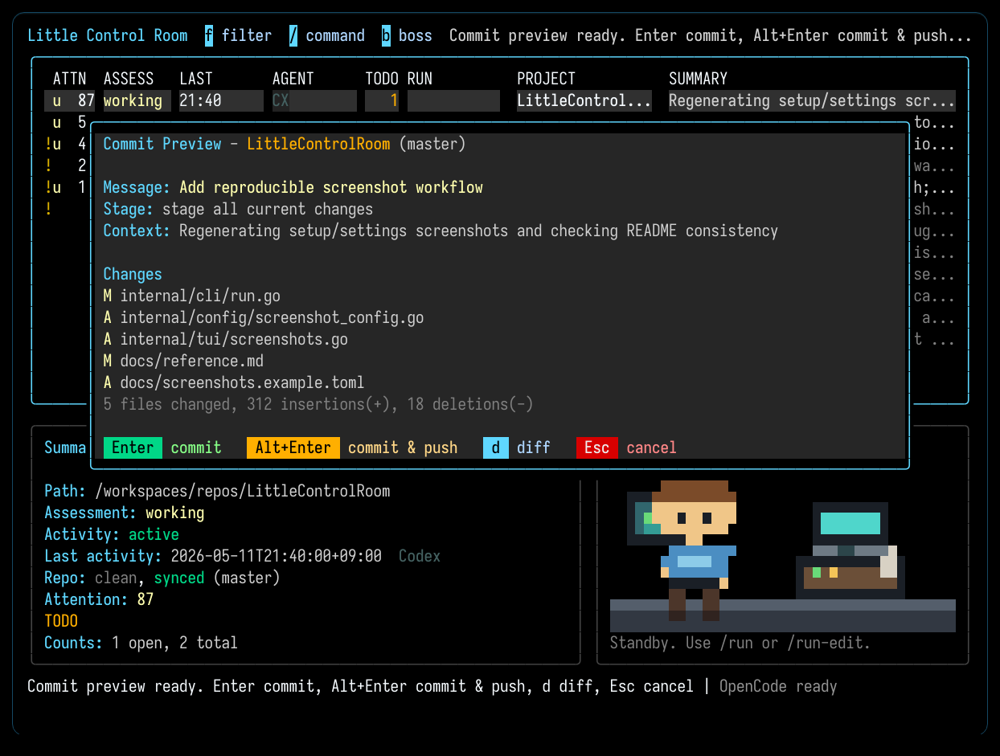
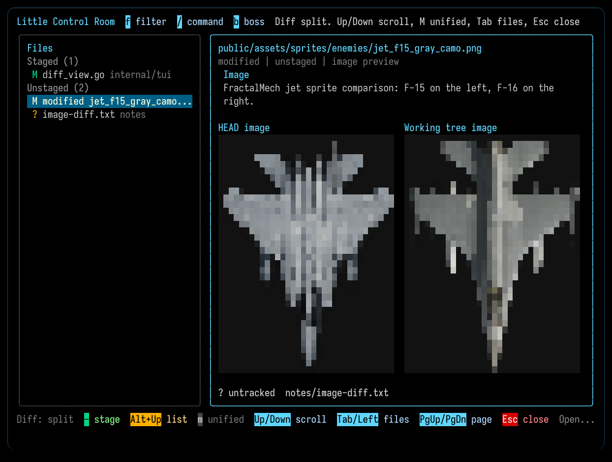

# Little Control Room

Little Control Room (LCR) is a terminal dashboard for keeping track of AI work across multiple local projects.

It finds recent Codex and OpenCode activity, highlights what needs attention, and lets you jump back into work without bouncing between repos and terminal tabs.

## Screenshots

Click any screenshot to open the full-size PNG on GitHub.

<p align="center">
  <a href="docs/screenshots/main-panel-live-cx.png">
    
  </a>
</p>

| Dashboard | Embedded Session |
| --- | --- |
| [](docs/screenshots/main-panel.png) | [](docs/screenshots/codex-embedded.png) |

| Diff View | Commit Preview |
| --- | --- |
| [](docs/screenshots/diff-view.png) | [](docs/screenshots/commit-preview.png) |

<p align="center">
  <a href="docs/screenshots/diff-view-image.png">
    
  </a>
</p>

## What It Does

- Finds recent Codex and OpenCode sessions across your local projects
- Shows which projects are active, idle, or worth revisiting
- Lets you open, resume, or switch embedded Codex or OpenCode sessions directly from the dashboard
- Keeps common actions close at hand: refresh, pin, snooze, multiline project notes with list badges, managed per-project run commands with runtime/port badges, diff, commit, and push

## What it doesn't do (yet)

- Many Codex slash-commands are missing.
- Some OpenCode details are still catching up with Codex.

## Quick Start

Requirements:

- Go 1.25+
- Codex installed locally, capable of running in the terminal.
- OpenCode installed locally if you want embedded OpenCode sessions.
- `OPENAI_API_KEY` in the environment (used for summaries, classifications, etc. not for coding).

Build and launch from this repo:

```bash
make build
./lcroom tui
```

Or install the CLI to your Go bin:

```bash
make install
lcroom tui
```

No config file is required for a first run. If you want to limit what shows up, open the dashboard and use `/settings`, or create `~/.little-control-room/config.toml` from [`docs/config.example.toml`](docs/config.example.toml).

The main commands to look for are `/settings`, `/open`, `/run`, `/run-edit`, `/runtime`, `/stop`, `/note`, `/diff`, `/commit`, `/finish`, `/push`, `/codex`, `/codex-new`, `/opencode`, and `/opencode-new`.

## Everyday Workflow

1. Start the dashboard with `lcroom tui` or `./lcroom tui`.
2. Move through projects with the arrow keys.
3. Press `Enter` to open or resume the selected project's latest embedded provider.
4. Press `Esc` or `Alt+Up` to hide the embedded session pane while it keeps working, then press `Enter` on that project to reopen it from the list.
5. Press `/` to open the command palette for actions like refresh, pin, snooze, note, diff, commit, or push.

Use `/run` to start the selected project's saved managed runtime. On the first run, LCR suggests a command from files like `bin/dev`, `package.json`, `Makefile`, `justfile`, or a simple Go entrypoint and lets you confirm or edit it before saving.

Use `/run-edit` to change the saved run command later, and `/stop` to stop the selected project's managed runtime.

The main view now keeps a dedicated runtime pane beside the detail pane. Use `Tab` or `/runtime` to focus it, then use `Left` and `Right` to choose `Open URL`, `Restart`, or `Stop`, and `Enter` to run the selected action.

Use `/codex` or `/opencode` to resume the last session.

Use `/codex-new` or `/opencode-new` when you want a fresh session instead of resuming an existing one.

Inside the embedded Codex or OpenCode pane, use `/resume` or `/session` to open a provider-specific session picker for the current project, or `/resume <session-id>` to jump straight to that session.

Use `/settings` when you want to save include or exclude paths or change the default Codex launch mode.

Use `/open` to open the selected project's folder in your system browser.

Use `/note` to open a multiline note editor for the selected project, or `/note clear` to remove the saved note after confirmation. Projects with saved notes show an `N` badge in the main list. Press `n` for the same editor as a shortcut. Inside the note dialog, `Ctrl+Y` copies the whole current note to the system clipboard, and the `Copy...` action offers either `Whole note` or `Selected text`. In selection mode, press `Space` once to mark the start, move the cursor, and press `Space` again to copy the selected range.

Projects with an active managed runtime show a short summary in the `RUN` column. Detected ports appear inline there as `@3000`, while `!3000` marks a managed port conflict between tracked projects. The detail pane stays focused on project metadata, while the separate runtime pane shows the saved command, runtime state, detected ports and URL, conflicts or errors, and the captured output tail.

Use `/diff` to open a full-screen git diff for the selected project, with staged files listed first on the left, unstaged files below them, and a scrollable text or image preview on the right.

To create a a new project, use the command `/new-project`. This will create a new directory or acknowledge an existing one, and add it to the list of projects to track.

## Costs

Using Codex or OpenCode inside LCR does not add any additional cost beyond what you would normally pay for those tools.

There are some OpenAI API costs from a key the user needs to provide (`OPENAI_API_KEY`). These are for LCR to
summarize sessions, classify them, help with commit messages.
These operations are done with cheaper models like `gpt-5-mini` and a relatively small amount of tokens, so the cost should be minimal, but it's important to keep an eye on usage from the OpenAI dashboard, to avoid any surprises.

## Notes

- Local state lives under `~/.little-control-room/`.
- For keys, slash commands, flags, and config details, see [`docs/reference.md`](docs/reference.md).

## Contacts

- Davide Pasca on X: [@109mae](https://x.com/109mae)
- NEWTYPE, Japan: [newtypekk.com](https://newtypekk.com/)

## Contributing

This is a utility that I constantly change to suit some specific needs. For this reason this is not a good candidate for external contributions, however, bug reports are welcome and anyone is free to fork and modify for their own use.
