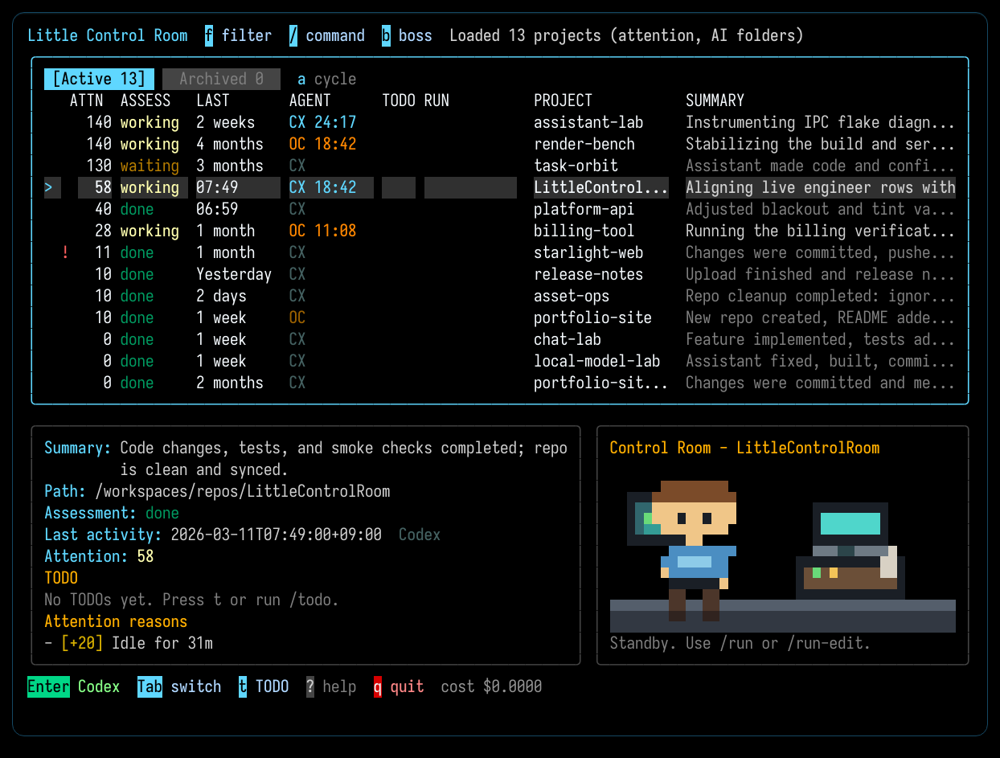
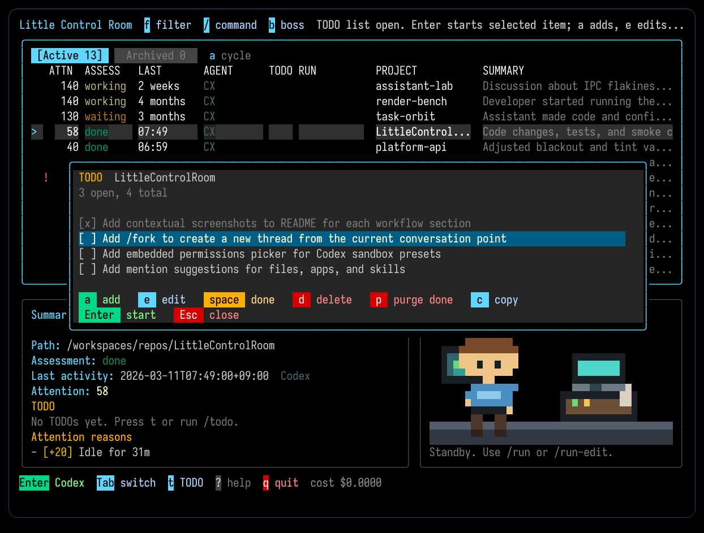
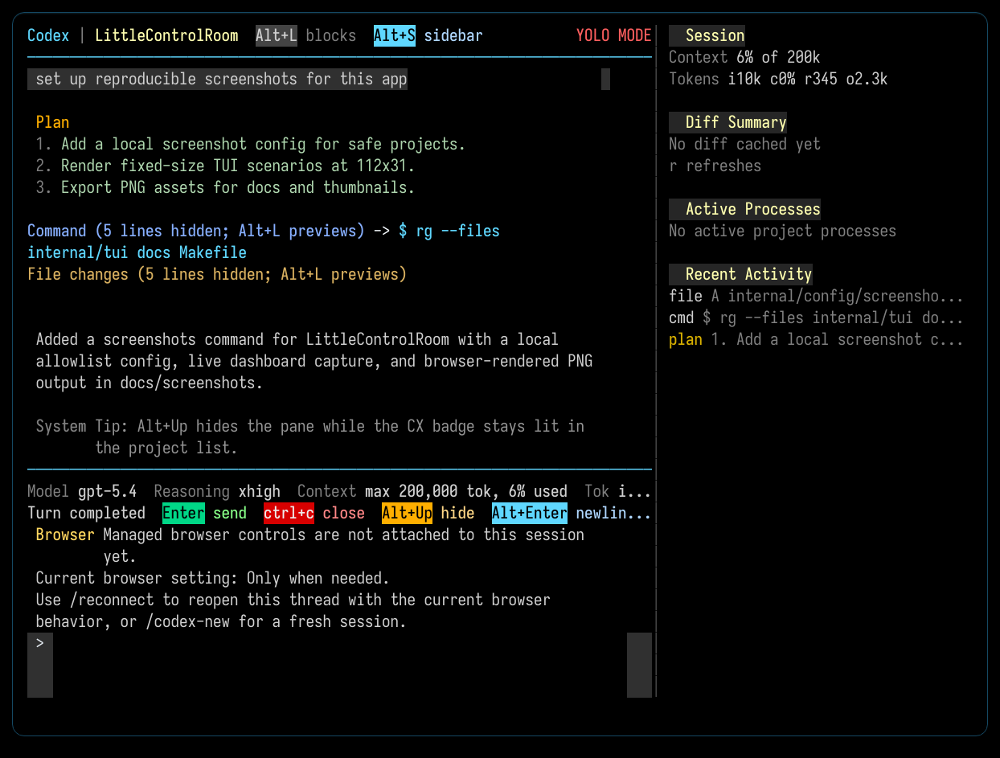
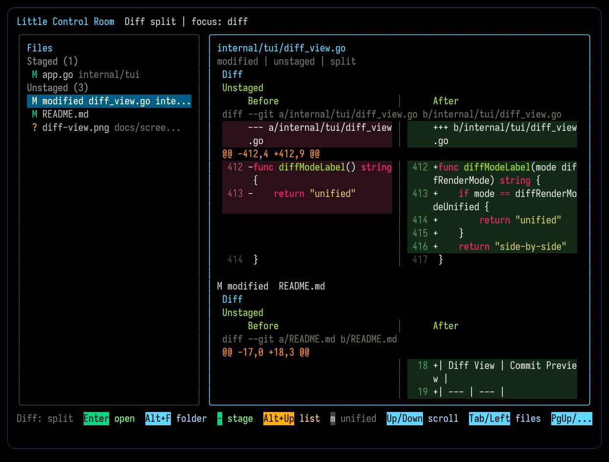
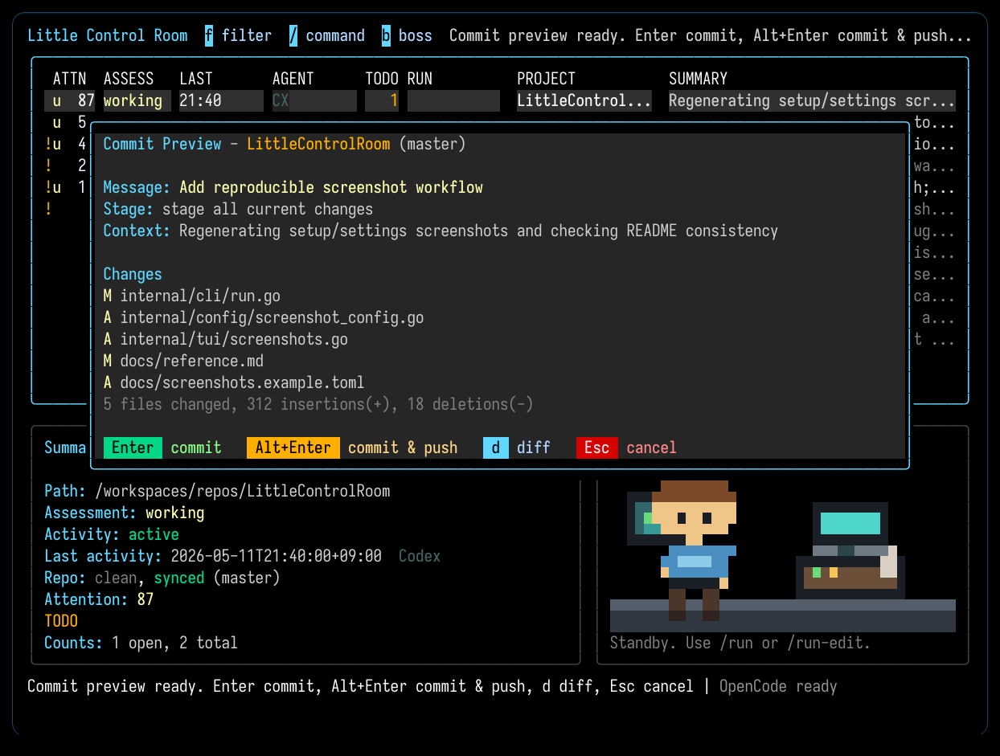
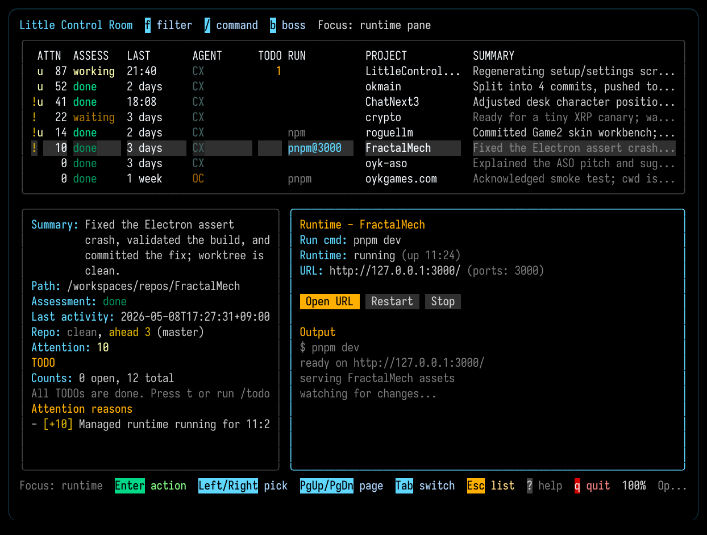
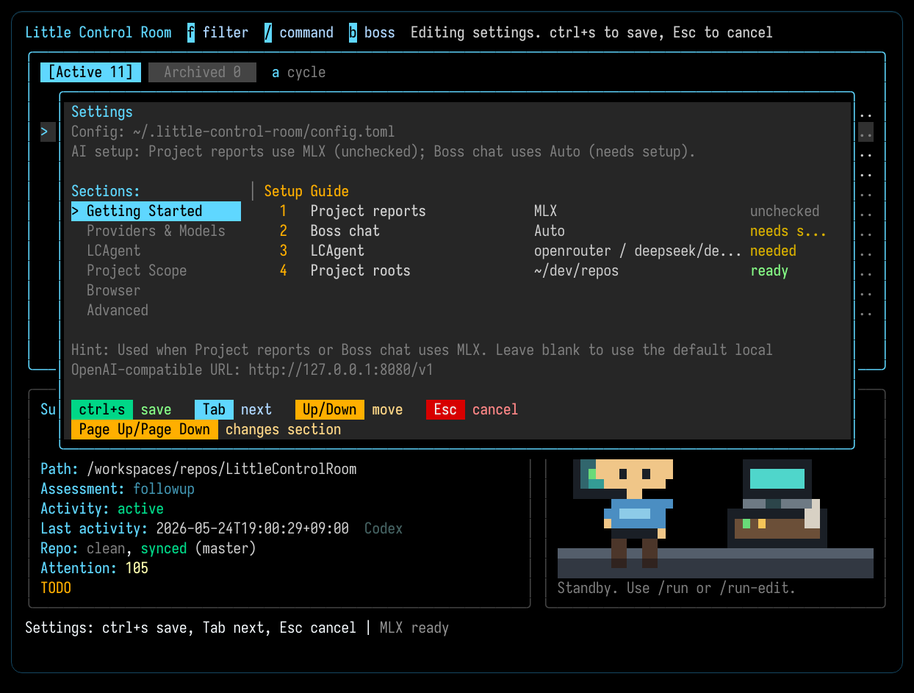

# Little Control Room

**One terminal window for every repo you have an agent working in.**

Little Control Room (LCR) keeps your Codex, Claude Code, and OpenCode sessions in
one dashboard: what is running, what is waiting on you, what is worth picking up
next — with the TODOs, worktrees, diffs, commits, and dev servers around them in
the same place.

<p align="center">
  <a href="docs/screenshots/main-panel.png">
    
  </a>
</p>

> **LCR does not replace your coding agents.**
> It drives the `codex`, `claude`, and `opencode` CLIs *you* already have
> installed and gives them one shared interface, one project list, and one
> workflow. The agents do the work; LCR is the room you run them from.

This is an opinionated open source tool that grew out of my own daily use across
many repos. It is used internally, but it is not a commercial product.

## What it does

- **Sees every repo at once.** Finds recent Codex, OpenCode, and Claude Code
  sessions across your local projects and shows which ones are active, idle, or
  worth revisiting.
- **Resumes anything in one keypress.** Open, resume, or switch embedded sessions
  from the list — including Claude Code sessions already running in another
  terminal.
- **Turns TODOs into agent work.** Each project has a TODO list; press `Enter` on
  an item to spin up a dedicated worktree and start an agent on it.
- **Keeps ports and stray processes under control.** Managed run commands, reuse
  instead of duplicate servers, port-conflict detection, and orphaned-process
  hunting.
- **Ships without leaving.** Diff, commit, push, pull, and background merge
  conflict resolution.
- **Lets agents see and talk back to LCR.** Progressive query and control
  catalogs let embedded agents inspect bounded cross-project state, file TODOs,
  and propose actions that you confirm in the TUI.

## Quick start

```bash
curl -fsSL https://raw.githubusercontent.com/dpasca/LittleControlRoom/master/install.sh | bash
lcroom tui
```

The installer puts `lcroom` and `lcagent` in `~/.local/bin` and prints a PATH hint
when needed. macOS and Linux are supported; Windows is not.

On first run, LCR opens `/setup` so you can pick a backend for its background
work. Read the next section before you choose.

### Give it a manager model

LCR is constantly doing small background jobs: project summaries, session
assessments, list titles, commit subjects, TODO and worktree suggestions. This is
the **`Project reports`** card in `/setup`, and it is separate from the agents that
write your code.

You can point it at Codex, Claude Code, or OpenCode and it will work with zero
extra setup or billing. But every one of those small jobs then goes through a full
agent CLI, and the dashboard updates at that pace.

**For the best experience, give it a cheap, fast API model instead.** Something
like DeepSeek `deepseek-v4-flash` or OpenAI `gpt-5.6-luna` costs very little and
makes the whole dashboard feel immediate. Available direct backends: OpenAI,
OpenRouter, DeepSeek, Moonshot, Xiaomi — or MLX/Ollama if you want it fully local.

<details>
<summary>Manual download</summary>

Download an archive from the [Releases page](https://github.com/dpasca/LittleControlRoom/releases):

| Platform | Release asset |
| --- | --- |
| macOS Apple Silicon | `lcroom_Darwin_arm64.zip` |
| macOS Intel | `lcroom_Darwin_x86_64.zip` |
| Linux ARM64 | `lcroom_Linux_arm64.tar.gz` |
| Linux x86_64 | `lcroom_Linux_x86_64.tar.gz` |

```bash
# Example: Linux x86_64
curl -L -o lcroom.tar.gz https://github.com/dpasca/LittleControlRoom/releases/latest/download/lcroom_Linux_x86_64.tar.gz
tar -xzf lcroom.tar.gz
./lcroom tui
```

Archives include `lcroom` and the sibling `lcagent` helper binary used by the
experimental embedded LCAgent provider. Move both to a directory on your `PATH`.

LCR is not published through Homebrew, apt, Snap, Flatpak, or Nix yet.

</details>

<details>
<summary>Build from source</summary>

Requires Go 1.26.5 or newer. Make targets default to `GOTOOLCHAIN=local`, so a
version mismatch fails instead of downloading another Go toolchain automatically.

```bash
make build          # local binary
make build-all      # lcroom + lcagent
make build-check    # the same module check, vet, tests, and build CI runs
make install        # install the CLI to your Go bin
./lcroom tui
```

</details>

<details>
<summary>Updating</summary>

Official GitHub release builds check for a newer stable release at TUI start, at
most once a day, and surface it as bright `/update <version>` text in the top bar.
Nothing is downloaded until you highlight `Update & restart` and confirm; the
updater then verifies SHA-256 digests and checksums, verifies Apple Developer
signatures on macOS, replaces both binaries with rollback protection, saves active
engineer turns, and restarts into the new version.

Source builds never contact GitHub. Set `LCR_DISABLE_UPDATE_CHECKS=true` to
disable the daily check while keeping manual `/update`. See
[Release Engineering](docs/release_engineering.md) for the full contract.

</details>

## The workflow

The loop LCR is built around:

**1. Capture a TODO.** Press `t` on any project. TODOs are repository-scoped, so
they follow the repo rather than the checkout you happen to be in.

**2. Launch it into its own worktree.** Press `Enter` on a TODO item. The launcher
defaults to a **dedicated worktree**: LCR creates the linked checkout, prepares it
(inheriting the source project's run command and initializing submodules), and
starts a fresh agent session there with the TODO as the prompt — so parallel tasks
never fight over one working tree. Switch to `Here` if you want it in place. Pick
the engineer — Codex, Claude Code, OpenCode, or the experimental LCAgent — and
press `m` to change the model. Repos only need
[`.lcroom/worktrees.toml`](docs/worktree_prep.md) if they want to customize or opt
out of preparation.

**3. Let it run; check back later.** `Esc` hides an embedded session while it keeps
working. The project row shows progress. `Enter` reopens it.

**4. Review and ship.** `/diff` for a full-screen diff with staging — including
[before/after previews for changed images](docs/screenshots/diff-view-image.png) —
`/commit` for a preview with AI-assisted commit subjects, then `/push`. `/pull`
fast-forwards with live transfer progress on the project row and can be cancelled
mid-flight with `/pull cancel`. `/resolve` hands merge conflicts to a background
agent session.

**5. Fold the work back.** `/wt update` merges the parent branch into a long-running
worktree without touching the canonical checkout. `/wt merge`, `/wt remove`, and
`/wt prune` handle the rest. `/wt restore` can rebuild an accidentally deleted
worktree from Git evidence and resume the exact Codex conversation that was in it.
Merged, clean worktrees whose latest assessed turn is done become **stale** after
24 hours without activity. Worktrees with no recorded session use their own Git
activity date and can also become stale. They are marked in the project list,
and `/clean` opens a batch review with every safe candidate selected by default.

| TODO list | Embedded session | Diff | Commit preview |
| --- | --- | --- | --- |
| [](docs/screenshots/todo-dialog.png) | [](docs/screenshots/codex-embedded.png) | [](docs/screenshots/diff-view.png) | [](docs/screenshots/commit-preview.png) |

### Agents that can reach back into LCR

Embedded Codex, Claude Code, and OpenCode sessions get an `lcr_runtime` MCP
server; LCAgent gets equivalent native read and confirmed-control adapters.
Through the progressive query catalog, agents can inspect bounded persisted
project, assessment, and delegated-work state across the non-private portfolio.
They can also discover the active or latest finalized demo recording as a typed
resource; raw package paths require portfolio query scope or an exact
host-provided attachment/confirmation grant.
The MCP surface also lets agents file duplicate-checked repository TODOs,
inspect and start managed processes, and progressively discover typed LCR
actions — including project creation — then queue them for explicit confirmation
in the TUI. Schemas load on demand, so the full query or action catalog never has
to sit in the model's context. Confirmed engineer-to-engineer messages are
stored durably before delivery and can target an exact Codex, OpenCode, Claude
Code, or LCAgent session; LCR steers eligible active Codex turns and queues
other busy recipients until their exact session is idle.

See [Progressive Agent Query Surface](docs/agent_query_surface.md) and
[Progressive Agent Control Surface](docs/agent_control_surface.md).

## Ports and stray processes

A normal problem when several repos are alive at once: two dev servers fighting
over `:3000`, or a build tool that got orphaned three hours ago and is still
burning a core.

- **Managed run commands.** `/run` starts a project's saved command; the row gets
  runtime and port badges. Starting a runtime that is already up **reuses** it
  instead of launching a duplicate. `/restart`, `/stop`, and `/run-edit` do the
  obvious things, and `/runtime` focuses the output pane.
- **`/ports`** scans project-local TCP listeners, shows which project owns each
  one, flags conflicts against another project's expected port, and lets you
  confirm-stop external listeners LCR did not start.
- **`/cpu`** lists the top CPU processes and calls out ones that have been
  reparented to PID 1 while still consuming CPU or holding ports.

The run-command editor completes package scripts, Make/Just targets, Go
entrypoints, and project-local paths one directory at a time. Captured output can
be copied with `c`, and **Add TODO** turns a failure into an editable TODO.

[](docs/screenshots/main-panel-live-runtime.png)

## Everyday keys

| Key | Action |
| --- | --- |
| `↑` `↓` | Move through projects |
| `Enter` | Open or resume the selected project's latest session |
| `Esc` | Hide the embedded pane; the session keeps working |
| `t` | TODO list for the selected project |
| `f` | Filter the project list |
| `a` | Cycle Main / category / Archived tabs |
| `p` | Pin |
| `/` | Command palette |
| `` ` `` | Help Chat |

Help Chat (`` ` `` or `/chat`) is an assistant over the dashboard. It can answer
questions about your projects, propose confirmable actions, and delegate work to
an engineer session. Its lean in-process LCAgent loop uses shared LCR query and
control tools, and shows model/tool activity plus periodic progress while a slow
backend is working. It needs its own backend, configured in the `Chat` card in
`/setup`. Treat it as **experimental**: it works, but it has not been exercised
much yet and its behavior may still change.

The full command list, keys, flags, and config reference live in
[`docs/reference.md`](docs/reference.md).

## Backends and models

LCR keeps two things separate:

**Embedded session providers** — the agents that write code. Codex, OpenCode, and
Claude Code, driven through their own CLIs and your own authentication. Plus the
experimental LCAgent, an LCR-native one-shot worker with provider-backed tool
calls.

**Background inference** — the manager model described above, plus Chat, which has
its own `boss_chat_backend` setting so interactive chat can use a different route
than recurring summaries.

Local inference works through MLX (`http://127.0.0.1:8080/v1`) and Ollama
(`http://127.0.0.1:11434/v1`). Pick one in `/setup`, leave the endpoint fields in
`/settings` blank for the defaults, or override them if your server runs
elsewhere. Ollama thinking stays off for background automation and structured
calls so models return usable JSON; Chat has its own thinking toggle.

To check whether a local model is good enough before trusting it, without touching
any repo state:

```bash
lcroom model-eval --backend ollama --model gemma4:12b-mlx
```

It covers summary text, session-assessment JSON, advice classification, and
commit-subject JSON. Partial passes are informative: a model can be fine for
commit help and free-form summaries while still failing the stricter dashboard
schemas.

<p align="center">
  <a href="docs/screenshots/settings-local-backends.png">
    
  </a>
</p>

### Costs

MLX and Ollama are local, so they cost nothing. Codex, OpenCode, and Claude Code
follow whatever plan or billing mode their own CLIs are using. With a cheap
manager model and a few active projects, a full day is often around `$1` to `$2` —
treat that as a rough guide, not a ledger.

**Claude Code is the subtle one.** Anthropic currently says Claude Pro/Max include
Claude Code terminal usage when authenticated with Claude credentials, but
`ANTHROPIC_API_KEY` switches Claude Code to API billing, and usage-credit
continuation after plan limits bills separately at API rates. Before starting an
embedded Claude session, LCR pauses and warns if it inherited a non-empty
`ANTHROPIC_API_KEY`; continuing acknowledges it for the rest of that run.
Claude-backed background inference defaults to Haiku to keep usage lighter. See
Anthropic's [plan billing](https://support.claude.com/en/articles/11145838-use-claude-code-with-your-pro-or-max-plan)
and [cost](https://code.claude.com/docs/en/costs) docs.

LCR-embedded Claude Code uses Claude's `auto` permission mode by default, while
keeping explicit permission and classifier fallback prompts connected to the
in-pane approval dialog. The pane badge reports the effective mode if Claude
falls back because the selected model, account, or managed policy does not
support Auto. `bypassPermissions` remains available as an explicit setting;
Codex and OpenCode keep their existing launch preset. See Anthropic's
[permission-mode guide](https://code.claude.com/docs/en/permission-modes).

## Safety rails

Agents with broad filesystem access make mistakes. LCR adds narrow seatbelts
rather than pretending to be a sandbox:

- **Guarded recursive `rm`.** Embedded agents can remove explicit files with
  ordinary non-recursive commands such as `rm TODO.md`. Recursive `rm` remains
  blocked for Claude Code and LCAgent in every permission mode. Codex additionally
  allows plain `rm -rf /tmp/<name>` when every target is a validated descendant
  of `/tmp`. This stops the common accidental command, not a determined one —
  keep your backups.
  ([threat model](docs/destructive_command_safety.md))
- **Repository home branch.** LCR keeps the primary checkout on a saved home
  branch, preferring the remote default from `origin/HEAD`. That home is separate
  from each linked worktree's merge target. `I` or `/integrity` explains any
  mismatch; automatic repair is only offered when it is provably safe.
  ([details](docs/repository_root_integrity.md))
- **Explicit confirmation.** Every action an agent proposes through the control
  surface waits for you in the TUI.
- **Conservative cleanup.** `/clean` only offers present, unpinned linked
  worktrees that are merged, clean, conflict-free, and inactive for more than
  24 hours. Recorded sessions must have a completed turn assessed done;
  worktrees without a recorded session use their own Git activity for age.
  Every selection is revalidated before removal; active turns and runtimes are
  skipped, while an idle
  LCR-managed engineer session is closed first. Branches and conversation
  history are preserved. Orphaned folders are deleted only when they contain
  a single `.DS_Store`, or when a stale worktree pointer and byte-for-byte Git
  verification prove that a partial removal contains no uncommitted files.

## More

- **[Mobile Preview](docs/mobile.md)** — monitor running agents from your phone
  over your LAN. Read-only by default, pairing required, still a preview.
- **[Demo recording](docs/reference.md#demo-recordings)** — `/record` starts and
  stops capture in the running TUI; `lcroom demo record` remains available for
  launch-time capture.
  captures hours of TUI activity as compressed text frames instead of pixel video,
  with a non-destructive clip editor and asciicast export. Private categories and
  embedded sessions for private projects are masked at capture time.
- **[Reference](docs/reference.md)** — every command, key, flag, and config option.
- **[Release Engineering](docs/release_engineering.md)** — signing, CI, and tagging.

Local state lives under `~/.little-control-room/`.

## OpenAI Build Week 2026

LCR predates Build Week: its multi-project dashboard, embedded agent sessions,
TODO/worktree workflow, and private project categories were already part of my
daily development environment. The Build Week submission is the extension built
between July 13 and July 21, 2026 — a privacy-aware way to record that real
workflow and turn a long working session into a concise, reviewable demo.

That work added rendered-frame terminal recording with seekable delta-compressed
chunks and a non-destructive clip editor; capture-time privacy masking that stores
a fixed private-view frame whenever a private category or an embedded session for
a private project is on screen; smart timing that accelerates low-information
screen churn and evens out pauses during visible input; and a source-based
`make tui-record` workflow with an isolated profile using GPT-5.6 for primary
reasoning and GPT-5.6 Luna for background inference.

| Date | Build Week extension | Commit |
| --- | --- | --- |
| July 19 | Rendered-frame recording and editing system | [`c36095d`](https://github.com/dpasca/LittleControlRoom/commit/c36095d) |
| July 20 | Source-based daily recording target | [`c531e7e`](https://github.com/dpasca/LittleControlRoom/commit/c531e7e) |
| July 20 | Capture-time masking for private views | [`8f0ef68`](https://github.com/dpasca/LittleControlRoom/commit/8f0ef68) |
| July 20 | Smart timing for demo playback | [`71396d9`](https://github.com/dpasca/LittleControlRoom/commit/71396d9) |
| July 20 | Full-frame clearing for reliable terminal playback | [`25483f3`](https://github.com/dpasca/LittleControlRoom/commit/25483f3) |

GPT-5.6 Sol in Codex helped implement and validate the recording, privacy, and
smart-timing workflow, and the final demo shows a real Codex session working on
that implementation. GPT-5.6 Luna also ran the final automated privacy review of
the demo; that review supplements, rather than replaces, a human full-resolution
check.

To exercise the recording extension directly from this branch, run `/record` in
the normal TUI, or use `make tui-record` for an isolated launch-time profile. See
[the Build Week demo notes](docs/build_week_demo.md) for the privacy boundary,
storage paths, and editor behavior.

## Contacts

- Davide Pasca on X: [@109mae](https://x.com/109mae)
- NEWTYPE, Japan: [newtypekk.com](https://newtypekk.com/)

## Contributing

This is a utility that I constantly change to suit specific needs, so it is not a
good candidate for external contributions. Bug reports are welcome, and anyone is
free to fork and modify for their own use.
